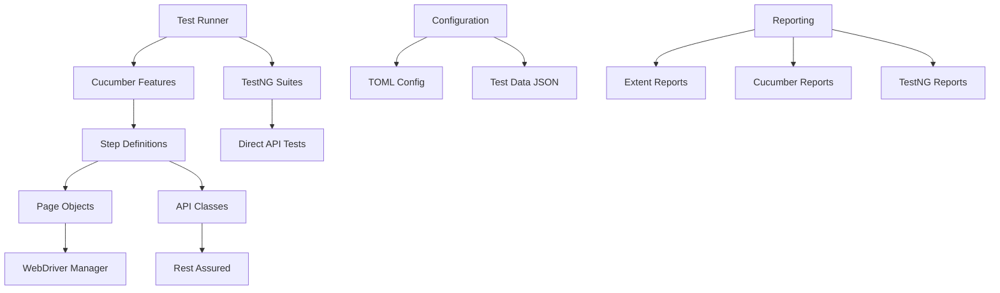

# SocialConnect Test Automation Framework

[](https://www.oracle.com/java/)
[](https://maven.apache.org/)
[](https://testng.org/)
[](https://cucumber.io/)
[](https://rest-assured.io/)
[](https://selenium.dev/)

## 🚀 Project Overview

**SocialConnect Test Automation Framework** is a comprehensive, enterprise-level test automation solution that demonstrates modern testing practices for a **Social Media Platform**. This framework integrates **UI automation**, **API testing**, and **BDD methodology** to provide complete test coverage for web applications.

The framework is built using **industry-standard technologies** and follows **best practices** for test automation, making it an ideal **portfolio project** for demonstrating expertise in **SDET** and **Test Automation Engineer** roles.

### 🎯 Application Under Test

**SocialConnect** - A fictional social media platform similar to Instagram/Facebook with the following features:
- User authentication & profile management
- Post creation & interaction (like, comment, share)
- Stories functionality
- Direct messaging
- Friend/Follow system
- Content discovery & search

### 🌐 API Integration

The framework integrates with **DummyJSON API** (`https://dummyjson.com`) providing:
- **Real API endpoints** with proper HTTP responses
- **JWT authentication** for security testing
- **CRUD operations** for comprehensive testing
- **Pagination and filtering** capabilities
- **Immediate functionality** without setup requirements

## 📋 Table of Contents

- [Technologies & Tools](#technologies--tools)
- [Framework Architecture](#framework-architecture)
- [Project Structure](#project-structure)
- [Prerequisites](#prerequisites)
- [Installation & Setup](#installation--setup)
- [Configuration](#configuration)
- [Test Execution](#test-execution)
- [Reporting](#reporting)
- [CI/CD Integration](#cicd-integration)
- [Best Practices](#best-practices)
- [Contributing](#contributing)
- [License](#license)

## 🛠 Technologies & Tools

### Core Technologies
| Technology | Version | Purpose |
|------------|---------|---------|
| **Java** | 11+ | Programming language foundation |
| **Maven** | 3.8.6 | Build automation and dependency management |
| **TestNG** | 7.8.0 | Test execution framework |
| **Cucumber** | 7.15.0 | Behavior-Driven Development (BDD) |
| **Rest Assured** | 5.3.2 | API testing library |
| **Selenium WebDriver** | 4.16.1 | UI automation |

### Supporting Libraries
| Library | Version | Purpose |
|---------|---------|---------|
| **Jackson** | 2.15.2 | JSON processing and data binding |
| **Extent Reports** | 5.0.9 | Advanced test reporting |
| **WebDriverManager** | 5.6.2 | Automatic browser driver management |
| **TOML4J** | 0.7.2 | Configuration file processing |
| **Apache Commons Lang** | 3.13.0 | Utility functions |

### Design Patterns Implemented
- **Page Object Model (POM)** - UI element management
- **Builder Pattern** - Request specification building
- **Factory Pattern** - Driver and API client creation
- **Singleton Pattern** - Configuration management
- **Data Transfer Object (DTO)** - API response modeling

## 🏗 Framework Architecture



The framework follows a **modular architecture** with clear separation of concerns:

- **Base Layer**: Core functionality and utilities
- **API Layer**: REST API testing capabilities
- **UI Layer**: Web automation using Page Object Model
- **Test Layer**: BDD scenarios and TestNG test classes
- **Data Layer**: Configuration and test data management
- **Reporting Layer**: Comprehensive test reporting

## 📁 Project Structure

```
SocialMediaTestFramework/
├── src/
│   ├── main/java/
│   │   ├── com/socialconnect/
│   │   │   ├── base/
│   │   │   │   ├── BaseTest.java           # Base test class with OOPS principles
│   │   │   │   ├── BaseAPI.java            # Core API testing foundation
│   │   │   │   └── TestContext.java        # Shared test context for data transfer
│   │   │   ├── pages/                      # Page Object Model implementation
│   │   │   │   ├── LoginPage.java          # Login page with Page Factory
│   │   │   │   ├── HomePage.java           # Dashboard and home functionality
│   │   │   │   ├── ProfilePage.java        # User profile management
│   │   │   │   ├── PostCreationPage.java   # Post creation and editing
│   │   │   │   └── MessagingPage.java      # Direct messaging features
│   │   │   ├── api/                        # API utility classes
│   │   │   │   ├── AuthAPI.java            # Authentication API operations
│   │   │   │   ├── PostAPI.java            # Post management APIs
│   │   │   │   ├── UserAPI.java            # User management APIs
│   │   │   │   └── APIEndpoints.java       # API endpoint constants
│   │   │   ├── utils/                      # Utility classes
│   │   │   │   ├── ConfigReader.java       # TOML configuration reader
│   │   │   │   ├── JSONUtils.java          # JSON handling utilities
│   │   │   │   ├── DatabaseUtils.java      # Database connection utilities
│   │   │   │   ├── ExtentReportManager.java # Extent reporting management
│   │   │   │   └── DriverManager.java      # WebDriver lifecycle management
│   │   │   ├── models/                     # Data model classes (POJOs)
│   │   │   │   ├── User.java              # User entity model
│   │   │   │   ├── Post.java              # Post entity model
│   │   │   │   └── AuthResponse.java      # Authentication response model
│   │   │   └── constants/
│   │   │       ├── ApplicationConstants.java
│   │   │       └── TestDataConstants.java
│   │   └── resources/
│   │       └── config.toml                 # TOML configuration file
│   └── test/
│       ├── java/
│       │   ├── stepDefinitions/            # Cucumber step definitions
│       │   │   ├── LoginStepDefinitions.java
│       │   │   ├── PostStepDefinitions.java
│       │   │   ├── APIStepDefinitions.java
│       │   │   └── Hooks.java              # Before/After hooks
│       │   ├── runners/                    # TestNG + Cucumber runners
│       │   │   ├── TestRunner.java         # Main BDD test runner
│       │   │   ├── SmokeTestRunner.java    # Smoke test execution
│       │   │   └── RegressionTestRunner.java # Full regression suite
│       │   └── apiTests/                   # Direct API test classes
│       │       ├── AuthenticationAPITest.java
│       │       ├── PostManagementAPITest.java
│       │       └── UserManagementAPITest.java
│       └── resources/
│           ├── features/                   # Cucumber feature files
│           │   ├── Authentication.feature  # User login/logout scenarios
│           │   ├── PostManagement.feature  # Post CRUD operations
│           │   ├── UserProfile.feature     # Profile management
│           │   ├── Messaging.feature       # Direct messaging
│           │   └── APIValidation.feature   # API-only test scenarios
│           ├── testData/                   # JSON test data files
│           │   ├── users.json             # User test data
│           │   ├── posts.json             # Post test data
│           │   └── apiTestData.json       # API-specific test data
│           ├── schemas/                    # JSON schema validation files
│           │   ├── userSchema.json        # User API response schema
│           │   ├── postSchema.json        # Post API response schema
│           │   └── authSchema.json        # Auth API response schema
│           ├── config/
│           │   └── application.properties  # Environment-specific properties
│           └── testng.xml                  # TestNG suite configuration
├── azure-pipelines.yml                    # Azure DevOps CI/CD pipeline
├── pom.xml                                 # Maven dependencies and plugins
├── README.md                               # Project documentation
└── .gitignore                              # Git ignore configuration
```

## 📋 Prerequisites

Before setting up the framework, ensure you have the following installed:

### Required Software
- **Java Development Kit (JDK) 11+**
- **Apache Maven 3.8+**
- **Git** for version control
- **IntelliJ IDEA** or **Eclipse** IDE (recommended)

### Browser Support
- **Google Chrome** (recommended)
- **Mozilla Firefox**
- **Microsoft Edge**
- **Safari** (macOS only)

### Optional Tools
- **Allure** for advanced reporting
- **Docker** for containerized execution
- **Azure DevOps** for CI/CD integration

## 🚀 Installation & Setup

### Step 1: Clone the Repository
```bash
git clone https://github.com/your-username/social-media-test-framework.git
cd social-media-test-framework
```

### Step 2: Install Dependencies
```bash
mvn clean install
```

### Step 3: Verify Installation
```bash
# Run smoke tests to verify setup
mvn test -Dcucumber.filter.tags="@smoke"

# Verify API connectivity
mvn test -Dcucumber.filter.tags="@api" -Dtest="**/AuthenticationAPITest.java"
```

### Step 4: IDE Configuration
#### IntelliJ IDEA
1. Open the project in IntelliJ IDEA
2. Install **Cucumber for Java** plugin
3. Install **TestNG** plugin
4. Configure **Project SDK** to Java 11+
5. Enable **annotation processing**

#### Eclipse
1. Import as **Maven Project**
2. Install **Cucumber Eclipse Plugin**
3. Install **TestNG for Eclipse**
4. Configure **Build Path** with Maven dependencies

## ⚙️ Configuration

### TOML Configuration File (`config.toml`)

```toml
[application]
base_url = "https://dummyjson.com"
api_base_url = "https://dummyjson.com"
timeout = 30
implicit_wait = 10

[browser]
default_browser = "chrome"
headless = false
window_size = "1920x1080"

[database]
host = "localhost"
port = 5432
name = "socialconnect_test"
username = "testuser"
password = "testpass"

[reporting]
extent_report_path = "./test-output/ExtentReport.html"
screenshot_on_failure = true
video_recording = false

[api]
auth_endpoint = "/auth/login"
posts_endpoint = "/posts"
users_endpoint = "/users"
comments_endpoint = "/comments"
refresh_endpoint = "/auth/refresh"
me_endpoint = "/auth/me"

[test_data]
default_user_file = "src/test/resources/testData/users.json"
posts_data_file = "src/test/resources/testData/posts.json"
```

### Environment-Specific Configuration

The framework supports multiple environments through system properties:

```bash
# Test environment (default)
mvn test -Denvironment=test

# Staging environment
mvn test -Denvironment=staging

# Production environment (read-only tests)
mvn test -Denvironment=production
```

## 🧪 Test Execution

### Running Different Test Suites

#### 1. Smoke Tests (Quick Validation)
```bash
mvn test -Dcucumber.filter.tags="@smoke"
```

#### 2. Regression Tests (Complete Suite)
```bash
mvn test -Dcucumber.filter.tags="@regression"
```

#### 3. API-Only Tests
```bash
mvn test -Dcucumber.filter.tags="@api"
```

#### 4. UI-Only Tests
```bash
mvn test -Dcucumber.filter.tags="@ui"
```

#### 5. Security Tests
```bash
mvn test -Dcucumber.filter.tags="@security"
```

### Parallel Test Execution

#### Enable Parallel Execution
```bash
# Parallel execution with 4 threads
mvn test -Dparallel=methods -DthreadCount=4

# Parallel execution for specific tags
mvn test -Dcucumber.filter.tags="@regression" -Dparallel=methods -DthreadCount=6
```

#### TestNG Parallel Configuration
```xml
<suite name="ParallelExecution" parallel="methods" thread-count="4">
    <test name="APITests">
        <classes>
            <class name="runners.TestRunner"/>
        </classes>
    </test>
</suite>
```

### Cross-Browser Testing

```bash
# Chrome (default)
mvn test -Dbrowser=chrome

# Firefox
mvn test -Dbrowser=firefox

# Edge
mvn test -Dbrowser=edge

# Headless Chrome
mvn test -Dbrowser=chrome -Dheadless=true
```

### Test Data Management

#### Dynamic Test Data Generation
```bash
# Generate fresh test data
mvn test -DgenerateTestData=true

# Use specific data set
mvn test -DtestDataSet=large-dataset
```

### Command Line Examples

```bash
# Complete regression suite with reporting
mvn clean test -Dcucumber.filter.tags="@regression" -DgenerateExtentReport=true

# API tests with specific environment
mvn test -Dcucumber.filter.tags="@api" -Denvironment=staging -Dparallel=methods

# UI tests with browser specification
mvn test -Dcucumber.filter.tags="@ui" -Dbrowser=firefox -Dheadless=false

# Security tests with detailed logging
mvn test -Dcucumber.filter.tags="@security" -DlogLevel=DEBUG -DcaptureScreenshots=true
```

## 📊 Reporting

The framework provides multiple reporting options for comprehensive test analysis:

### 1. Extent Reports (Primary)
- **Location**: `target/ExtentReport.html`
- **Features**: Interactive HTML reports with screenshots, logs, and charts
- **Real-time**: Live reporting during test execution

### 2. Cucumber Reports
- **HTML Report**: `target/cucumber-reports/index.html`
- **JSON Report**: `target/cucumber-reports/Cucumber.json`
- **XML Report**: `target/cucumber-reports/Cucumber.xml`

### 3. TestNG Reports
- **HTML Report**: `test-output/index.html`
- **XML Results**: `test-output/testng-results.xml`

### 4. Allure Reports (Optional)
```bash
# Generate Allure reports
mvn allure:report

# Serve Allure reports
mvn allure:serve
```

### Report Configuration

#### Extent Report Configuration
```markdown
```java
ExtentSparkReporter sparkReporter = new ExtentSparkReporter("target/ExtentReport.html");
sparkReporter.config().setTheme(Theme.DARK);
sparkReporter.config().setDocumentTitle("SocialConnect Test Report");
sparkReporter.config().setReportName("API & UI Test Execution Report");
```

#### Custom Reporting
The framework supports custom reporting through:
- **Screenshot capture** on test failure
- **API request/response logging**
- **Performance metrics tracking**
- **Test data snapshots**

## 🔄 CI/CD Integration

### Azure DevOps Pipeline

The framework includes a comprehensive **Azure DevOps YAML pipeline** (`azure-pipelines.yml`) with the following features:

#### Pipeline Stages
1. **Build Stage**: Compile and validate code
2. **Test Stage**: Execute test suites with parallel execution
3. **Reporting Stage**: Publish test results and artifacts

#### Pipeline Parameters
- **Test Suite Selection**: smoke, regression, api, security, all
- **Environment Target**: test, staging, production
- **Parallel Execution**: Enable/disable with thread count configuration
- **Browser Selection**: chrome, firefox, edge

#### Example Pipeline Execution
```yaml
parameters:
  testSuite: 'regression'
  environment: 'test'
  parallelExecution: true
  threadCount: 4
```

#### Scheduled Execution
```yaml
schedules:
  - cron: "0 2 * * *"  # Daily at 2 AM
    displayName: 'Nightly Regression Tests'
    branches:
      include:
        - main
```

### Jenkins Integration (Alternative)
```groovy
pipeline {
    agent any
    
    stages {
        stage('Test Execution') {
            steps {
                sh 'mvn clean test -Dcucumber.filter.tags="@smoke"'
            }
        }
        
        stage('Publish Results') {
            steps {
                publishHTML([
                    allowMissing: false,
                    alwaysLinkToLastBuild: true,
                    keepAll: true,
                    reportDir: 'target/cucumber-reports',
                    reportFiles: 'index.html',
                    reportName: 'Test Report'
                ])
            }
        }
    }
}
```

## 📝 Best Practices

### Code Quality Standards
- **SOLID Principles**: Applied throughout framework architecture
- **DRY Principle**: Reusable components and utilities
- **Clean Code**: Meaningful naming conventions and documentation
- **Error Handling**: Comprehensive exception handling and logging

### Test Design Patterns
- **AAA Pattern**: Arrange, Act, Assert for test structure
- **Builder Pattern**: Fluent API request building
- **Factory Pattern**: Object creation abstraction
- **Strategy Pattern**: Multiple browser and environment support

### API Testing Best Practices
- **JSON Schema Validation**: Automated response structure validation
- **Response Time Assertions**: Performance validation
- **Status Code Verification**: Comprehensive HTTP response checking
- **Data-Driven Testing**: Parameterized test execution
- **Negative Testing**: Error scenario validation

### UI Testing Best Practices
- **Explicit Waits**: Reliable element interaction
- **Page Object Model**: Maintainable UI automation
- **Cross-Browser Support**: Multi-browser compatibility
- **Mobile Responsive**: Responsive design testing
- **Screenshot Capture**: Visual validation and debugging

### Maintenance Guidelines
- **Regular Dependency Updates**: Keep libraries current
- **Code Review Process**: Maintain code quality
- **Documentation Updates**: Keep documentation synchronized
- **Performance Monitoring**: Track test execution times
- **Test Data Refresh**: Maintain relevant test data

## 🤝 Contributing

We welcome contributions to improve the SocialConnect Test Automation Framework!

### How to Contribute
1. **Fork the repository**
2. **Create a feature branch**: `git checkout -b feature/new-feature`
3. **Make your changes** with appropriate tests
4. **Follow coding standards** and add documentation
5. **Submit a pull request** with detailed description

### Code Standards
- Follow **Java naming conventions**
- Add **JavaDoc comments** for public methods
- Include **unit tests** for new utilities
- Update **README.md** for new features
- Ensure **all tests pass** before submitting

### Reporting Issues
- Use the **GitHub Issues** section
- Provide **detailed reproduction steps**
- Include **environment information**
- Add **relevant logs and screenshots**

## 📄 License

This project is licensed under the **MIT License** - see the [LICENSE](LICENSE) file for details.

## 📞 Contact & Support

- **Project Maintainer**: [Your Name](mailto:your.email@example.com)
- **GitHub Issues**: [Create an Issue](https://github.com/your-username/social-media-test-framework/issues)
- **Documentation**: [Wiki Pages](https://github.com/your-username/social-media-test-framework/wiki)

---

## 🎯 Framework Highlights

This framework demonstrates **enterprise-level capabilities** essential for **SDET** and **Test Automation Engineer** roles:

✅ **Comprehensive API Testing** with Rest Assured  
✅ **Behavior-Driven Development** with Cucumber  
✅ **Cross-Browser UI Automation** with Selenium  
✅ **Advanced Reporting** with multiple formats  
✅ **CI/CD Integration** with Azure DevOps  
✅ **Parallel Test Execution** for efficiency  
✅ **Data-Driven Testing** with JSON test data  
✅ **Security Testing** capabilities  
✅ **Performance Validation** features  
✅ **Production-Ready Architecture** with design patterns

**Perfect for demonstrating technical expertise in job interviews and building a strong automation portfolio!**

---

*Made with ❤️ for the Test Automation Community*